<div align="center">

# 🪶 hermes-router

> **A simple LLM router that picks the cheapest capable model — and lets you
> always choose between the free pool and the paid pool.**

[](#)
[](#license)
[](config.yaml)
[](config.yaml)
[](#-usage)
[](tests/)
[](#-hermes-agent-plugin)
[](#-free-vs-paid--the-one-knob)

<p align="center">
  
</p>

A Python CLI that **routes any prompt to the cheapest LLM that can answer it**,
across **11 OpenAI-compatible providers** you already have keys for.
Built on top of the keys Hermes stored for you — no re-exporting needed.

Comes in two flavours: a **standalone CLI** (`hr` — for your terminal) and a
**Hermes Agent plugin** (`hr_route`, `hr_models`, `hr_doctor` — tools Hermes
can call). Same engine, different surfaces.

</div>

---

## 🎉 What's new in 2.2.1

hermes-router 2.2.1 is a patch release that makes the installer work
cleanly on **macOS** and **Windows 11 WSL2** — not just Linux.

| Improvement | How it works |
|-------------|--------------|
| **Platform detection** | Auto-detects `linux` / `macos` / `wsl` via `sys.platform` + `/proc/version`. Banner shows the label; WSL/macOS-specific notes print after. |
| **Per-platform PATH hints** | macOS bash → `~/.bash_profile` (not `~/.bashrc`); macOS zsh → `~/.zshrc`; WSL → `~/.bashrc` + `~/.profile` (Windows Terminal login shells). |
| **Tab-completion in more rc files** | Now activates in `~/.zshrc`, `~/.bash_profile`, `~/.zprofile`, and `~/.profile` if they exist (was only `~/.bashrc` / `~/.zshrc`). |
| **venv preflight check** | If `python3-venv` is missing, prints the right install command for your distro (apt/dnf/pacman) instead of failing mid-install. |
| **README "Platform support" section** | Per-OS install instructions + troubleshooting. |

Backward-compatible with 2.2.0 — no API changes, no config changes.
Skip auto-rc-edits with `--no-completion` as before.

## 🎉 What's new in 2.2

hermes-router 2.2 adds **shell tab-completion** so you can discover every
subcommand and flag by hitting <kbd>Tab</kbd> — no more `hr --help` to find
the right flag name.

| Feature | How it works |
|---------|---------------|
| **Tab-completion** for bash / zsh / fish | Built on [`argcomplete`](https://github.com/kislyuk/argcomplete). Auto-reads every argparse definition — zero hand-maintained completion strings. New flags appear in completion for free. |
| **Auto-activated** on install | The installer writes a small eval block to your `~/.bashrc` / `~/.zshrc` (and `~/.config/fish/completions/hr.fish` for fish). Open a new shell and `hr <Tab>` just works — no manual `eval` needed. |
| **Clean uninstall** | The same block is removed on uninstall. Re-running install is idempotent — no duplicated snippets. |
| **Per-flag choices** | `--class free|paid|any`, `--tier cheap|standard|pro` — all completable. |
| **Subcommand names** | `hr <Tab>` shows all 8 subcommands. |
| **Zero manual sync** | Add a new flag in `add_subparser()` and it shows up in <kbd>Tab</kbd> the next time you install. |

Backwards compatible with 2.1. `argcomplete` is a small dependency
(~50 KB) and is skipped silently if not installed. Skip the auto-activation
with `--no-completion` if you'd rather wire it yourself.

## 🎉 What's new in 2.1

hermes-router 2.1 makes the agent **automatically route everyday prompts
through the cheapest free-tier model** — no need to ask "route this
through the free pool" anymore.

| Feature | How it works |
|---------|---------------|
| **Hybrid routing** — automatic cost reduction | New `hr_route_default` tool + plugin directive. Hermes uses it for greetings, summaries, translations, short code, factual Q&A — saving money on every routine turn. Complex tasks still use Hermes's default model (e.g. minimax). |
| **`hr_route_default(prompt, tier, max_tokens)`** | New tool that wraps `hr_route --class free` with sensible defaults. Picked automatically by the agent. |
| **Plugin directive** | A `directive:` field in `plugin.yaml` tells Hermes when to prefer the cheap router. |
| **Clean uninstall** | No `~/.hermes/config.yaml` modifications — uninstall is a single step that reverts to Hermes's default. |

## 🎉 What's new in 2.0

hermes-router 2.0 was the previous major release. The CLI now offers:

| Feature | Command / flag |
|---------|---------------|
| **Auto-fallback** (free → paid) | `hr route --auto-fallback` |
| **Per-provider fallback chains** | `policy.fallback_chains` in config.yaml |
| **Model blacklist / prefer** | `policy.model_filters` in config.yaml |
| **Verbose health check** | `hr doctor --verbose` |
| **Parallel fallback** (3 candidates) | `policy.parallel_timeout` in config.yaml |
| **Per-call cost cap** | `hr route --max-cost 0.01` |
| **Session cost tracking** | `hr chat --show-cost` |
| **Interactive setup wizard** | `hr init` |
| **Rich `--help`** with colors + icons | `hr --help` |
| **New sub-command** | `hr init` (8 total now) |

Backward compatible with v1.0 configs — old `zai_fallback_chain` is
auto-merged into `fallback_chains: {zai: ...}`.

---

## 🌊 Table of contents

1. [🌟 Why this exists](#-why-this-exists)
1. [⚡ Quick start: install in 2 minutes](#-quick-start-install-in-2-minutes)
1. [🪶 Using hr in your terminal (CLI)](#-using-hr-in-your-terminal-cli)
   1. [Tab-completion (bash / zsh / fish)](#tab-completion-bash--zsh--fish)
1. [🌐 Platform support](#-platform-support)
1. [🧩 Hermes Agent plugin: use from chat](#-hermes-agent-plugin-use-from-chat)
1. [📦 Alternative install methods](#-alternative-install-methods)
1. [🗑️ Uninstall](#-uninstall)
1. [🔑 Where keys come from](#-where-keys-come-from)
1. [🎯 Usage reference](#-usage-reference)
1. [🧠 How it picks](#-how-it-picks)
1. [🐍 Programmatic use](#-programmatic-use)
1. [⚙️ Configuration](#-configuration)
1. [🧪 Testing](#-testing)
1. [⚠️ Known quirks](#-known-quirks)
1. [📜 Background](#-background)
1. [📄 License](#-license)

---

## 🌟 Why this exists

> _"A simple hermes-router that works flawlessly."_  — you, today

There are a lot of LLM providers now. Many of them are *free right now* if you
sit on the right subscription — **z.ai's Coding Plan**, **GitHub Models' free tier**,
**Gemini's flash quota**, **Kilo Code's monthly prepaid**, etc. But you have to
know each one's quirks: which models they expose, what the request format
looks like, whether the token actually costs money.

**`hermes-router` collects this so you don't have to.** Run `hr models` and you'll
see everything that's wired up at a glance. Run `hr route --class free` and you
get the cheapest free answer that still meets the capability bar. Run
`hr route --class paid` when you need a model the free tier doesn't expose.

The router **either succeeds** or **reports every model it tried and why each one
failed** — no silent "I gave up". Every response includes a `fallbacks_tried`
trace.

### ✨ Feature highlights

| Feature | Symbol | Meaning |
|---|---|---|
| **Free vs paid pool**              | 🟢🟡 | Always pick; never silent surprise bills |
| **Multi-key rotation**            | 🔑     | One provider, N keys, automatic failover |
| **Fail-fast on permanent errors** | ⚡     | 404 → 1 attempt, not 16. No retry storms. |
| **Circuit breaker**                | 🛡️     | 3+ retryable failures → skip for the rest of the call |
| **Hermes auth integration**       | 🪶     | Reads `~/.hermes/.env` + `~/.hermes/auth.json` automatically |
| **Vision routing**                 | 👁     | Auto-pick VLMs when images are attached |
| **Zero new dependencies**          | 🪶     | Just PyYAML. Nothing else. |

---

## ⚡ Quick start: install in 2 minutes

> **Tested on:** Linux (Pi, Ubuntu, Fedora, Arch), macOS (Catalina+),
> Windows 11 WSL2. The installer detects your platform and adapts:
> PATH hints target the right rc files (`~/.zshrc` on macOS, `~/.bashrc` +
> `~/.profile` on WSL, etc.), and bash_profile/zshrc are auto-activated
> for tab-completion. See [Platform support](#-platform-support) below.

### Step 1 — Install (one command, no cd needed)

Open a terminal and paste this:

```bash
python3 -c "$(curl -fsSL https://raw.githubusercontent.com/jphermans/hermes-router-cli/main/bootstrap-install.py)"
```

That's it. No `cd`, no `git clone`, nothing else. The script:

1. Downloads the project
1. Extracts it into **`~/.hermes/hermes-router/`** (right next to Hermes' own config)
1. Creates a Python virtual environment (`.venv`)
1. Installs PyYAML
1. Creates a **`hr`** command on your PATH
1. Installs the **Hermes Agent plugin**
1. Runs a health check

You'll see something like:

```
📁 Installing into /home/you/.hermes/hermes-router
...
✓ config.yaml                loaded 11 providers
✓ providers with keys        10/11 have at least one key configured
...
━━━━━━━━━━━━━━━━━━━━━━━━━━━━━━━━━━━━━━━━━━━━━━━━━━━━━━━━
  All set.
━━━━━━━━━━━━━━━━━━━━━━━━━━━━━━━━━━━━━━━━━━━━━━━━━━━━━━━━
```

### Step 2 — Test the CLI

Try these commands to see if everything works:

```bash
hr --version             # shows "hermes-router 1.0.0"
hr doctor                # health check — shows your providers
hr route --prompt "Say hello in Dutch" --class free --pretty
```

If `hr doctor` shows your providers and `hr route` returns an answer,
you're all set.

**Bonus: tab-completion is already active.** The bootstrap wrote a small
eval block to your `~/.bashrc` (and `~/.zshrc` / `~/.config/fish/` if
present). Open a new shell and try `hr <Tab>` — you'll see all 8
subcommands. Skip this with `--no-completion` if you'd rather wire it
yourself.

### Step 3 — Enable the Hermes plugin

To use the router from inside a Hermes chat session:

```bash
hermes plugins enable hermes-router
```

Then start a **new Hermes session** (exit and re-launch, or type `/reset`
inside a session). Now you can use it from chat — see the plugin section below.

### What got installed where

| What | Installed at | How to use it |
|---|---|---|
| **CLI** (`hr`) | `~/.local/bin/hr` → `~/.hermes/hermes-router/hr` | Type `hr route`, `hr doctor`, `hr models` in your terminal |
| **Project** | `~/.hermes/hermes-router/` | Contains `.venv/`, `config.yaml`, source code |
| **Plugin** | `~/.hermes/plugins/hermes-router/` | Enabled with `hermes plugins enable hermes-router` |
| **Plugin tools** | Loaded by Hermes at session start | Say "route this through the free pool" in CLI, Telegram, or any channel |
| **Telegram** | No extra setup — works after `/reset` | Send "Run hr_doctor" or "Route this through the free pool" |

### Watch the install in action

A 48-second terminal recording showing the full install + 7 key features,
paced so each step is easy to follow:

<a href="https://asciinema.org/a/ATsjFLuxbM03PHLU" target="_blank"></a>

The `.cast` file is in [`docs/install-demo.cast`](docs/install-demo.cast) — play it locally with:

```bash
asciinema play docs/install-demo.cast
```

The recording shows: install → `hr --version` → `hr doctor` →
`hr doctor --verbose` → `hr route --class free` → `hr route --auto-fallback`
→ `hr budget --last 3` → `hermes plugins enable --allow-tool-override`
→ chat usage example.


---

## 🌐 Platform support

The installer auto-detects your platform (`linux`, `macos`, `wsl`) and
adapts. Banner shows the detected label; you'll see WSL-specific or
macOS-specific notes printed right after.

### Linux (Raspberry Pi / Ubuntu / Fedora / Arch / etc.)

Works out of the box on any distro with Python 3.11+ and `python3-venv`.

```bash
# Debian/Ubuntu/Raspbian — install prereqs once
sudo apt install python3 python3-venv python3-pip

# Fedora / RHEL
sudo dnf install python3 python3-pip

# Arch
sudo pacman -S python python-pip
```

PATH: `~/.local/bin` is on PATH automatically via XDG Base Directory
on most distros. If `which hr` returns nothing after install, add:

```bash
echo 'export PATH="$HOME/.local/bin:$PATH"' >> ~/.bashrc
```

Tab-completion: activated in `~/.bashrc` (and `~/.profile` for login
shells — some SSH sessions source only profile).

### macOS (Catalina+ / Big Sur / Monterey / Sonoma / Sequoia)

Default shell is zsh. The installer detects macOS via `sys.platform`
and activates `~/.zshrc` for tab-completion + shows PATH hints
specific to macOS.

```bash
# Install Python via Homebrew (recommended) — system Python is too old
brew install python3

# OR use pyenv for version management
brew install pyenv
pyenv install 3.12
```

PATH: macOS does NOT add `~/.local/bin` to PATH by default. The
installer prints the right rc file for your shell (zshrc on zsh,
bash_profile on bash):

```bash
# zsh (Catalina+ default) — add to ~/.zshrc
export PATH="$HOME/.local/bin:$PATH"

# bash (older macOS) — add to ~/.bash_profile (NOT .bashrc!)
export PATH="$HOME/.local/bin:$PATH"
```

Tab-completion: activated in `~/.zshrc` (or `~/.bash_profile` if you
still use bash). After install, open a **new Terminal window** — tab
completion doesn't activate in already-running shells.

### Windows (WSL2 only)

Native Windows is not supported — install under WSL2 instead. The
installer detects WSL via `/proc/version` content ("microsoft" / "WSL"
markers) and prints WSL-specific notes.

```bash
# Inside your WSL2 distro (Ubuntu/Debian default)
sudo apt update
sudo apt install python3 python3-venv python3-pip
```

PATH: same as Linux. Tab-completion is activated in BOTH `~/.bashrc`
(interactive shells) and `~/.profile` (login shells from Windows
Terminal — these skip bashrc by default).

> **WSL tips:**
> - Don't install under `/mnt/c/...` (Windows filesystem) — use the
>   Linux filesystem (`~`) for speed and to avoid path translation bugs.
> - If `python3` resolves to `/mnt/c/.../python.exe`, fix your WSL PATH:
>   in `/etc/wsl.conf` add `[interop] appendWindowsPath = false`.
> - The installer uses Linux symlinks — Windows symlinks (in WSL) are
>   not the same. Always stay in the Linux FS.

### What the installer does per platform

| Action | Linux | macOS | WSL |
|---|---|---|---|
| Detect via | `sys.platform == 'linux'` + `/proc/version` | `sys.platform == 'darwin'` | `/proc/version` contains `microsoft` / `wsl` |
| Venv path | `<prefix>/.venv/bin/python` | same | same |
| Symlink target | `~/.local/bin/hr` | same | same |
| PATH hint rc file | `~/.bashrc` + `~/.profile` | `~/.zshrc` (zsh) or `~/.bash_profile` (bash) | `~/.bashrc` + `~/.profile` |
| Tab-completion rc | `~/.bashrc` (and zshrc if present) | `~/.zshrc` (or bash_profile) | `~/.bashrc` + `~/.profile` |
| Fish detection | `~/.config/fish/` | `~/.config/fish/` | `~/.config/fish/` |

Skip the auto-rc-edit entirely with `--no-completion`.

### Troubleshooting per platform

**Linux: "PyYAML missing" or venv create failed**
→ `sudo apt install python3-venv python3-pip` (or your distro equivalent).

**macOS: `python3` not found**
→ `brew install python3` (Apple's system Python is end-of-life).

**macOS: tab-completion doesn't work after install**
→ Did you open a **new** Terminal window? Tab-completion activates at
shell startup; existing shells won't pick it up.

**WSL2: tab-completion doesn't work in Windows Terminal**
→ We write to `~/.bashrc` AND `~/.profile`. If Windows Terminal still
doesn't show completions, check your default shell with `echo $SHELL`
— if it's not bash, set Windows Terminal to use bash as the default
profile.

**macOS: SIP-related write failures**
→ We install to `~/.hermes/hermes-router/` (user-owned) — never touches
`/usr/local` or `/System`. SIP shouldn't affect us, but if it does,
check `ls -ld ~/.hermes`.

---

## 🪶 Using hr in your terminal (CLI)

The `hr` command works from anywhere in your terminal. It shares API keys
with Hermes — no extra setup needed.

### Quick help with colors and icons

`hr --help` (or `hr -h`) shows a rich, color-coded cheat sheet with all
sub-commands, their flags, and common recipes:

```bash
hr --help
```

When run in a terminal, this prints a colorized reference with:

- 📋 **Quick reference** — setup, daily use, and monitoring recipes
- 🔧 **Sub-commands** — full per-command flag list (auto-extracted from the code)
- 💡 **Common flags** — `--class`, `--tier`, `--pretty`, `--json`, `--max-tokens`, `--max-cost`
- 🔀 **Auto-fallback & cost control** — `--auto-fallback`, `--max-cost`
- 📚 **More info** — links and pointers

For detailed options on a single command, use `hr <command> --help` —
e.g. `hr route --help`, `hr chat --help`, `hr budget --help`.

> **Note:** colors and icons only render when stdout is a TTY (interactive
> terminal). Piped output (`hr --help | cat`) stays plain text — script-friendly.

### Tab-completion (bash / zsh / fish)

Hit <kbd>Tab</kbd> to discover every subcommand, flag, and choice — no more
guessing or `hr --help` lookups. Powered by
[`argcomplete`](https://github.com/kislyuk/argcomplete) (auto-installed by
the bootstrap as of v2.2).

**Auto-activated on install.** The bootstrap writes a small eval block to
your `~/.bashrc` (and `~/.zshrc` if you have one, or
`~/.config/fish/completions/hr.fish` for fish). Open a new shell and
`hr <Tab>` just works. Re-running install is idempotent — no duplicated
snippets. Uninstall removes the block automatically.

```bash
# What you get (try it in any new shell):
hr <Tab>                # → route models verify auth doctor budget chat init
hr route --<Tab>        # → --prompt -p --tier --class --max-tokens --pretty …
hr route --class <Tab>  # → free paid any
hr route --tier <Tab>   # → cheap standard pro
hr models --class <Tab> # → free paid any
hr doctor --<Tab>       # → --json --verbose
```

**Manual activation** (only needed if you skipped `--no-completion` or use
a non-standard shell):

```bash
# bash — add to ~/.bashrc
eval "$(register-python-argcomplete hr)"

# zsh — add to ~/.zshrc
autoload -U bashcompinit && bashcompinit
eval "$(register-python-argcomplete hr)"

# fish — add to ~/.config/fish/config.fish
register-python-argcomplete hr | source
```

> **Tip:** `register-python-argcomplete` is symlinked into `~/.local/bin/`
> during install, so it's reachable as a bare command. If it's not on your
> `PATH`, point at the full path:
> `eval "$(~/.hermes/hermes-router/.venv/bin/register-python-argcomplete hr)"`

**To remove the auto-activation block manually**, open `~/.bashrc` (or
`~/.zshrc`) and delete the section between
`# >>> hermes-router tab-completion (...) >>>` and
`# <<< hermes-router tab-completion (...) <<<` (the markers include a
random token so they're easy to find).

### Check the health of your setup

```bash
hr doctor
```

Shows which providers have keys, how many free/paid models are available,
and any configuration issues.

### Route a prompt

```bash
# Free pool (subscription plans) — recommended for everyday use
hr route --prompt "Translate hello to French" --class free --pretty

# Paid pool (billed APIs) — when you need a smarter model
hr route --prompt "Write a React component" --class paid --pretty

# Let the router decide (any pool, cheapest first)
hr route --prompt "Summarize this: ..." --class any --pretty
```

### List available models

```bash
hr models                          # all models, all providers
hr models --class free             # only free models
hr models --class paid --tier pro  # only paid pro-tier models
```

### Check which API keys are loaded

```bash
hr auth                            # masked output (secure)
hr auth --show                     # shows last 4 chars of each key
```

### Interactive REPL

```bash
hr chat
```

Type prompts, get answers. **Ctrl-D to exit.**

For a full command reference, see the [Usage reference](#-usage-reference) section.

---

## 🧩 Hermes Agent plugin: use from chat

### What the plugin does

The plugin adds three **tools** that Hermes (the AI agent) can call when you
ask it to. You don't type slash commands like `/hr doctor` — you just say
what you want in natural language.

### Available tools

| Tool | What it does | When to use |
|---|---|---|
| `hr_route_default(prompt, tier, max_tokens)` | **PREFERRED DEFAULT** — routes through cheapest free-tier model. Hermes uses this automatically for everyday prompts (greetings, summaries, translations, short code, factual Q&A) | "Just talk to me" — saves cost on every routine turn |
| `hr_route(prompt, cost_class, tier, ...)` | Routes a prompt with explicit cost_class / tier / vision / max-cost options | "Route this through the paid pool", "vision prompt", "max $0.01 on this call" |
| `hr_models(cost_class, tier)` | Lists available models across all providers | "Which free models do I have?" |
| `hr_doctor()` | Health check — providers, keys, config | "Is everything working?" |

### Hybrid routing — automatic cost reduction

The plugin now ships a **directive** in `plugin.yaml` that tells Hermes
to prefer `hr_route_default` for everyday conversation. This is the
**hybrid** behavior:

- **Simple / routine prompts** (greetings, summaries, translations,
  factual Q&A, short code snippets) → Hermes calls `hr_route_default`
  → routes through the cheapest free-tier model (e.g. GitHub Models,
  Kilo, z.ai GLM Coding Plan). **You pay $0.**
- **Complex tasks** the user explicitly marks as reasoning,
  architecture, multi-step debugging → Hermes uses its default
  model (e.g. `minimax`).

You don't need to say "route this through the free pool" anymore — the
agent picks automatically. You can still force specific routing with
`hr_route` when you want to override.

### Uninstall is clean — no config changes to revert

Because the plugin only adds tools + a directive (it does **not**
modify `~/.hermes/config.yaml`), uninstall is a single clean step:

```bash
hermes plugins disable hermes-router
hermes plugins remove hermes-router
rm -f ~/.local/bin/hr
rm -rf ~/.hermes/hermes-router
```

Hermes automatically reverts to its standard model — nothing to undo in
`config.yaml`.

### How to use it — chat examples

Once the plugin is enabled and you've started a new session (`/reset`), just
tell Hermes what you want. Here are real examples:

#### Health check
> **You:** "Run hr_doctor to check my providers"
>
> **Hermes:** ✓ config.yaml loaded 11 providers, 10 with keys, 21 free models...

#### Route through the free pool
> **You:** "Route 'vertaal hallo naar Frans' door de free pool"
>
> **Hermes:** ✓ github_models/gpt-4o-mini (~$0.000000)
>
> "Hallo" in het Frans is "Bonjour".

#### Route through the paid pool
> **You:** "Route this through the paid pool: Write a Python script to parse a JSON file"
>
> **Hermes:** ✓ deepseek/deepseek-chat (~$0.000900)
>
> ```python
> import json
> with open("data.json") as f:
>     data = json.load(f)
> ...
> ```

#### List models
> **You:** "Show me hr_models with only free providers"
>
> **Hermes:** Lists 21 free models across 5 providers

#### What NOT to do
> **You:** `/hr doctor`
>
> **Hermes:** ❌ Unknown command

### Using from Telegram

The plugin works on **Telegram too** — no extra setup. Just make sure you've
enabled the plugin (`hermes plugins enable hermes-router`) and then send a
message on Telegram. The tools are available on every channel Hermes runs on.

**Important:** if you enabled the plugin while a Telegram session was already
active, send `/reset` (or `/new`) first so Hermes reloads its tools. After
that, just talk normally:

| You type in Telegram... | What happens |
|---|---|
| `Run hr_doctor` | Hermes calls `hr_doctor()` and replies with the health report |
| `Route 'vertaal hallo naar Frans' door de free pool` | Hermes calls `hr_route()` and returns the translation |
| `Which free models do I have?` | Hermes calls `hr_models()` and lists them |
| `Schrijf een Python script om een JSON bestand te lezen, betaalde pool` | Hermes calls `hr_route()` with `--class paid` |
| `/hr doctor` | ❌ Unknown command — same as in the CLI, no `/hr` slash command |

> **Tip:** need a fresh session? Send `/reset` in Telegram to reload tools.
> The gateway restarts with `/restart`.

### Important: Tools ≠ Slash Commands

The plugin adds **tools** (functions the AI agent can call), not **slash commands**
(things you type starting with `/`). This is how Hermes plugins work:

| You say... | What happens |
|---|---|
| "Run hr_doctor" | ✅ Hermes calls `hr_doctor()` and shows the health report |
| "Route this through the free pool: vertaal hallo naar Frans" | ✅ Hermes calls `hr_route()` and returns the answer |
| "Which free models do I have?" | ✅ Hermes calls `hr_models()` and shows the list |
| `/hr doctor` | ❌ Unknown command — Hermes has no `/hr` slash command |

> **In short:** tell the agent what you want in plain language, don't type
> a slash command. The agent decides when to use the plugin tools.

### What the plugin shares with Hermes

- **API keys** — same `~/.hermes/.env` (set once, works for both)
- **Config** — hermes-router reads `config.yaml` from its own project dir
- **venv** — the `.venv/` inside `~/.hermes/hermes-router/.venv/`

The CLI (`hr` in your terminal) and the plugin tools (`hr_route` etc. inside
Hermes) use the **same engine** — same config, same keys, same venv. The
difference is just how you reach it.

### Uninstall the plugin

```bash
hermes plugins disable hermes-router        # disable without removing
hermes plugins remove hermes-router         # delete the plugin entirely
```

---

## 📦 Alternative install methods

### Via git clone

```bash
git clone https://github.com/jphermans/hermes-router-cli.git
cd hermes-router-cli
python3 install.py                  # 🚀 colour output, full setup
```

That single command does everything:

1. 🐍 **Creates a `.venv`** (re-uses an existing one if present)
1. 📚 **Installs PyYAML** into it
1. 🔓 **Marks `hr` executable**
1. 🔗 **Symlinks `~/.local/bin/hr`** so `hr` works from anywhere on your PATH
1. 🧩 **Installs the Hermes plugin** (`~/.hermes/plugins/hermes-router/`) — skip with `--no-plugin`
1. 🩺 **Runs `hr doctor`** and prints a colourised health report

It's **idempotent** — running it again detects existing state and skips the work.

### Install flags

```bash
python3 install.py --no-color      # 📄 plain text (or set NO_COLOR=1)
python3 install.py --no-symlink    # 🔓 skip ~/.local/bin
python3 install.py --no-plugin     # 🧩 skip Hermes plugin install
python3 install.py --no-doctor     # 🩺 skip the post-install health check
```

### Manual install (no installer)

```bash
cd hermes-router-cli
python3 -m venv .venv && source .venv/bin/activate
pip install -r requirements.txt
ln -s "$(pwd)/hr" ~/.local/bin/hr   # optional — for `hr` on PATH
```

### Bootstrap flags (for the curl one-liner)

```bash
# Pin to a specific commit for reproducibility
python3 -c "$(curl -fsSL https://raw.githubusercontent.com/jphermans/hermes-router-cli/main/bootstrap-install.py)" \
  -- --ref 38abc1a

# Install to a custom location
python3 -c "$(curl -fsSL ...)" -- --prefix ~/my-custom-path
```

Everything after `--` goes straight to `install.py`.

---

## 🗑️ Uninstall

### Remove everything

```bash
hermes plugins disable hermes-router      # 1. disable the Hermes plugin
hermes plugins remove hermes-router       # 2. remove it entirely
rm -f ~/.local/bin/hr                     # 3. remove the CLI symlink
rm -rf ~/.hermes/hermes-router             # 4. delete the project
```

### One-command script (easiest)

```bash
bash ~/.hermes/scripts/uninstall-hermes-router.sh
```

> This script removes everything — plugin, symlink, project directory — in one
> go. Installed automatically by the bootstrap; no download needed.

### Via the installer script

```bash
python3 install.py uninstall --dry-run       # 👀 see what would be removed
python3 install.py uninstall                 # 🗑️  remove ~/.local/bin/hr (interactive confirm)
python3 install.py uninstall --yes --purge   # 🔥 also delete .venv/ (no venv left behind)
```

---

## 🔑 Where keys come from

The router reads API keys in **three places**, in priority order:

| # | Source | What lives there | Who writes it |
|---|---|---|---|
| 1️⃣ | **process env** (`GLM_API_KEY=...`) | whatever you `export` in your shell, CI, `systemd --setenv`, etc. | you, manually |
| 2️⃣ | **`~/.hermes/.env`** 🏠 | all Hermes' keys in dotenv form | `hermes auth add`, your hand |
| 3️⃣ | **`~/.hermes/auth.json`** 📋 | Hermes' structured credential pool | `hermes auth add`, Hermes itself |

If Hermes already has keys configured, `hr route` picks them up automatically —
**you don't need to re-export anything**. Just run `hr route --prompt "..."`
and it will discover whichever providers have keys present.

You can override the file paths for testing or container setups:

```bash
export HERMES_ENV_FILE=/etc/hermes/keys.env       # 🏠  default: ~/.hermes/.env
export HERMES_AUTH_FILE=/etc/hermes/auth.json     # 📋  default: ~/.hermes/auth.json
```

### Configure your API keys manually

If you don't use `hermes auth add`, you can set them yourself. Pick whichever
form fits you — all three work and merge automatically:

```bash
export GLM_API_KEY=sk-...               # 🔑 single key — singular form
export OPENROUTER_API_KEYS=sk-1,sk-2,sk-3   # 🔑🔑 multiple keys — plural form
export OPENROUTER_API_KEY_2=sk-2         # 🔑 also numbered: KEY_2, KEY_3, ...
```

If you keep keys in `~/.hermes/.env`, `hr auth` will scan it for you:

```bash
hr auth                # 🔒 show which keys are present (values masked)
hr auth --show         # 🔓 show last-4 of each key
```

---

## 🎯 Usage reference

### Dry-run — see the plan, spend nothing

```bash
hr route --prompt "Translate 'hello' to French" --dry-run --pretty
```

```
[dry-run] classified as cheap  cost_class=any
   1.     zai                glm-4.5-air                          [cheap   /free ]  $0.000000
   2.     kilo               tencent/hy3                          [pro     /free ]  $0.000000
   3.     openrouter         meta-llama/llama-3.1-8b-instruct     [cheap   /paid ]  $0.000013
   4.     venice             openai-gpt-oss-120b                  [cheap   /paid ]  $0.000023
   ...
```

The `class` column tells you which pool each candidate comes from.
`$0.000000` free models always rank above priced ones because cost dominates
the sort.

### Real call

```bash
hr route --prompt "Translate 'hello' to French" --pretty
```

```
✓ zai/glm-4.5-air  (~$0.000000, 1 tries)

"Bonjour."
```

### Choose the pool explicitly

```bash
hr route --prompt "Summarize this PDF" --class free --tier standard   # 🟢 free pool only
hr route --prompt "Reason step-by-step about this proof" \           # 🟡 paid pool only
            --class paid --tier pro
hr route --prompt "Quick translation" --class any --tier cheap       # 🌐 cheapest anywhere
```

`--tier` overrides the heuristic classifier (`cheap` / `standard` / `pro`).
`--class` selects the pool.

### Vision prompts

```bash
hr route --prompt "What's in this image?" --image https://.../photo.jpg --pretty     # 🌍 URL
hr route --prompt "OCR this" --vision --image data:image/png;base64,...               # 🧬 data URL
```

The router only sends vision prompts to `vision: true` models. The same
`--class free|paid|any` filter applies within the vision pool.

### Sub-commands

| Command | What it does |
|---|---|
| `hr models`                          | 📚 table of every configured model |
| `hr models --class free --tier pro`  | 🎯 filtered |
| `hr models --with-keys-only`         | 🔑 skip providers whose key isn't set |
| `hr verify`                          | 🩺 1-token ping every model (slow; sanity check) |
| `hr doctor`                          | 🩺 config + auth + coverage report |
| `hr budget`                          | 💰 this month's spend per provider |
| `hr chat`                            | 💬 interactive REPL — type prompts, get answers |
| `hr auth`                            | 🔐 which providers have keys |

`hr chat` opens a loop; type prompts, get answers. **Ctrl-D to exit.**

---

## 🧠 How it picks

1. 🎚️ **Classify** the prompt into a tier (`cheap` | `standard` | `pro`)
   using a pure-heuristic regex + token-length scan. No LLM call —
   no extra cost.

   * **Pro signals:** `reason`, `analyze`, `debug`, `multi-step`, `refactor`,
     `architect`, `optimize`, `investigate`, …
   * **Cheap signals:** `translate`, `summarize`, `rephrase`, `extract`, `list`,
     `title`, `convert`, `format`, `yes or no`, …
   * **Long prompts** (> ~4 kB) bump cheap → standard (larger context).

   Override with `--tier`.

1. 🧹 **Filter** candidates to the pool you asked for (`free` / `paid` /
   `any`), then to models that meet the classified tier (with optional
   tier-upgrade). Vision prompts: only vision-capable models survive.

1. 💱 **Rank** the survivors by `est_cost = in_tokens × input_price +
   out_tokens × output_price`. `$0` models always win. Ties broken by
   capability tier.

1. ⚡ **Call** the cheapest. On failure, **retry inside the same provider by
   rotating keys** (if the provider has multiple), with exponential backoff.

   **Fail-fast on permanent errors**: HTTP 400/401/403/404/422/… mean
   "this request itself is wrong" — don't retry, don't rotate keys, don't
   try other variants. Skip immediately to the next candidate. Cuts wasted
   time on auth/permissions/model-not-found from O(keys × retries) to **1
   attempt**.

1. 🔁 **Fall back** in this order:
   1. Next-cheapest candidate in the price-ranked plan.
   1. The configured **curated chain** (defaults to a small set of
      good-fast-cheap alternatives; configurable in `config.yaml` as
      `policy.zai_fallback_chain`).
   1. Any other model that wasn't in the plan, regardless of tier, still
      respecting `cost_class` and `vision`.

   **🛡️ Circuit breaker**: in any single `route()` invocation, a
   `(provider, model)` that accumulates **3+ retryable failures**
   (429/5xx/timeout) gets temporarily skipped for the rest of the run. The
   router doesn't waste budget hammering a known-broken provider while
   looking for a working one elsewhere.

1. 📋 **Return** either the answer, or a complete trace of every attempt +
   error. Each attempt entry records whether it was `permanent` (skipped
   all keys), `retryable` (transient, retried with backoff), or `ok`
   (succeeded).

The whole thing runs in one Python process. **No daemon, no DB, no proxy.**

---

## 🐍 Programmatic use

```python
from smart_router.route import route

result = route("Translate hello to French", cost_class="free")
print(result["selected_provider"], result["response"])
print("💰 cost:", result.get("est_cost_usd"))
print("🔁 tried:", result.get("fallbacks_tried"))
```

```python
# With images 👁
result = route("What's in this?", images=["data:image/png;base64,iVBOR..."])

# With a specific tier 🎯
result = route("Reason about X", force_tier="pro", cost_class="paid", max_out=1024)
```

All costs are **estimated**; real billed amounts may differ slightly because the
router estimates input tokens at ~4 chars/token.

---

## 🔧 Troubleshooting FAQ

### "PyYAML is required" when running `hr`

```
✗ PyYAML installed  PyYAML is required to parse config.yaml.
```

The `.venv/` isn't set up correctly. Fix it:

```bash
cd ~/.hermes/hermes-router
python3 install.py --no-symlink
```

### `hr: command not found`

The symlink in `~/.local/bin/` is missing, or `~/.local/bin/` isn't on your `PATH`.

```bash
# Check whether the symlink exists
ls -la ~/.local/bin/hr

# If not, create it:
ln -s ~/.hermes/hermes-router/hr ~/.local/bin/hr

# Add ~/.local/bin to PATH (in ~/.bashrc or ~/.zshrc):
echo 'export PATH="$HOME/.local/bin:$PATH"' >> ~/.bashrc
source ~/.bashrc
```

### "Unknown command" for `/hr doctor` in Hermes chat

The plugin adds **tools**, not **slash commands**. Just say "Run hr_doctor" in chat — don't type `/hr doctor`.

If the plugin tools don't appear, check whether the plugin is enabled (`hermes plugins list | grep hermes-router`) and send `/reset` in chat to start a new session.

### All providers fail with 401 (unauthorized)

Your API keys are not (correctly) configured. Check with:

```bash
hr auth
```

Keys need to live in `~/.hermes/.env`. For example:

```bash
echo "GLM_API_KEY=sk-..." >> ~/.hermes/.env
echo "OPENROUTER_API_KEY=sk-..." >> ~/.hermes/.env
```

### Free pool fails: "no free-tier candidates"

Not all providers have a free tier. Check whether you have at least one free provider with keys:

```bash
hr doctor
hr auth | grep free
```

Providers like z.ai (GLM Coding Plan), Kilo Code, GitHub Models, and Gemini free do have free tiers.

### `hr route --class free` picks a paid model

That can't happen — `--class free` filters strictly to free models. If you see a paid model in `--dry-run`, the provider has `cost_class: free` in `config.yaml` but the model itself has `cost_class: paid`. Check with `hr doctor --verbose`.

### Router is slow / timeout

The new parallel fallback tries the first 3 candidates simultaneously. If that's still too slow:

```bash
# Lower the parallel timeout in config.yaml:
# policy.parallel_timeout: 10
```

Or use `--dry-run` to see which providers would be tried.


Edit `config.yaml` to add/remove providers or change prices:

```yaml
providers:
  my_provider:
    env_key: MY_API_KEY          # 🔑 env var holding the key(s)
    base_url: https://api.my.com/v1
    cost_class: paid             # 🟡 or "free"
    models:
      - name: my-fast
        tier: cheap
        input_price: 0.10        # 💵 USD per 1M tokens
        output_price: 0.50
        context: 32768
        vision: false            # 👁 set true if model accepts images
      - name: my-pro
        tier: pro
        input_price: 1.00
        output_price: 3.00
        context: 200000
        vision: true
```

`cost_class` can be set on the provider (default for all models in it) or per
model (overrides). Two providers can share `env_key`; `hr auth` will see one
combined entry.

### 🟢 Free vs paid — the one knob

`cost_class: free` and `cost_class: paid` are *user-facing concepts*. You can
always pick one with `--class`. The router never silently routes between them —
there's no `promote free to paid if free fails` rule.

| Pool | Examples |
|---|---|
| 🟢 **free** | Subscription plans (z.ai Coding Plan, Kilo Code, MiniMax prepaid, …), public free tiers (Gemini free, GitHub Models free, OpenRouter `:free` models), local inference (base_url + no API key needed) |
| 🟡 **paid** | Everything with a real USD bill |

If you want "**always free first, paid only when free failed**":

```bash
hr route --prompt "..." --class free   # 🟢 try this first
hr route --prompt "..." --class paid   # 🟡 retry with this if free failed
```

The router itself doesn't bridge the two because the use case is genuinely
different (zero-extra-cost vs billable-by-API).

---

## 🧪 Testing

A full test suite (no external dependencies beyond `pyyaml`):

```bash
source .venv/bin/activate
python -m tests.smoke     # 🧪 21 unit + CLI tests, no network required
```

This exercises:

- 🧠 Heuristic classifier (cheap / standard / pro / long-prompt bump)
- 💰 Budget save/load/record/cap
- 🔑 Multi-key env collection + dedupe
- 🟢🟡 Cost-class filter (free / paid)
- 👁 Vision routing forces vision-flagged models only
- 🔁 Curated fallback chain (simulated provider failure)
- 🔂 Per-key rotation
- ⚡ Permanent vs retryable HTTP errors (`_classify_http`)
- 🚫 Fail-fast: one attempt on a 404, not N keys
- 🛡️ Circuit breaker limiting retryable failures
- 🪶 All CLI sub-commands (`route`, `models`, `verify`, `auth`, `doctor`,
  `budget`, `chat`) including `--pretty`, `--dry-run`,
  `--class free|paid|any`, and key-masking in `hr auth`.

### Live integration test against a fake server

```bash
# Terminal 1: a tiny test server that always returns 200
python -m tests.fake_server

# Terminal 2: drive it with a side-loaded config that points at the dummy URL,
# then run hr route — see `https://github.com/.../tests/fake_server.py`.
```

The server accepts any `POST /chat/completions` and always returns a valid 200
+ non-empty body. To test error handling, swap its base path to `/empty` (for
the empty-response gotcha) or `/fail/N` (for the first N requests returning
500 then succeeding — exercises the retry + fallback chain).

---

## ⚠️ Known quirks

- **Reasoning models** (z.ai GLM-5.x, MiniMax M-series, deepseek-reasoner)
  burn output tokens on internal `ˆÕÈ` blocks before the visible answer
  appears. Use `--max-tokens 300+` for cheap tasks and `≥ 800` for pro tasks
  so the model has budget left over for the actual response. `route()`
  already triggers fallback on an empty response.

- **`hr verify`** fires one HTTP request per model — useful for a one-shot
  health check, expensive at scale. Don't add it to cron without thinking.

- **The curated fallback chain** (`zai_fallback_chain`) is currently keyed
  to z.ai overloading — if you remove z.ai the chain still works but you
  might prefer to rename the field to `primary_fallback_chain` to reflect
  reality.

---

## 📜 Background

This project grew out of two earlier routers. One (`Shaf2665/Hermes-router`) is
a full **Flask proxy** with key rotation, dashboard, response caching,
SQLite, and a Codex OAuth importer — a different shape: a server. We borrowed:

- 🔑 the **multi-key env convention** (`KEY`, `KEYS`, `KEY_2`)
- ⚡ the **priority order** for handling provider overload
  (price rank → curated chain → broader sweep)

…and explicitly **didn't borrow** 🚫:

- 🐢 the server, the dashboard, the database, the SSE streaming
- 📚 the model-ratings dictionary (we keep tiers simpler)
- 🔐 the auth-key dashboard

The other parent was a personal `smart-llm-router` that picked cheapest-capable
from a flat pool of OpenAI-compatible providers. We extended that with:

- 🟢🟡 explicit `--class free|paid` (it had no notion of pool)
- 🔂 per-provider key rotation
- 🔁 multi-tier fallback trace (`fallbacks_tried`)
- 🧰 7 sub-commands instead of one giant flag set
- 👁 vision routing with multi-image payloads
- 💻 a real CLI with sub-commands and a REPL

---

## 📄 License

MIT — see the [LICENSE](LICENSE) file.

---

<div align="center">

<sub>Built with 🪶 by JP's Hermes Agent on a Raspberry Pi 5.
All routes tested, no daemon required. 🧪✓</sub>

</div>
